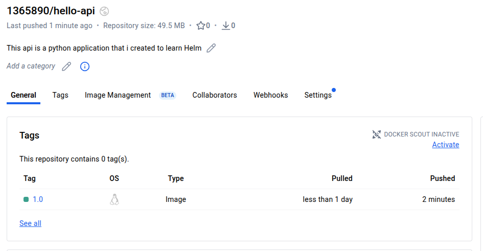
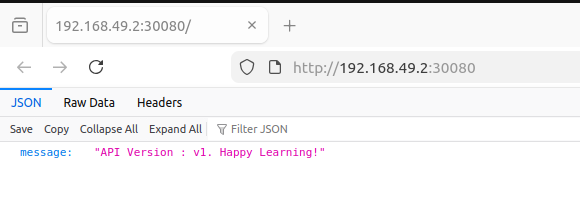
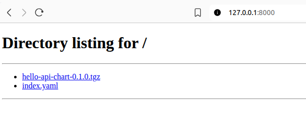

# 🧑‍💻 About the Project

This project demonstrates a complete containerized deployment workflow using a simple Python FastAPI application. The API is packaged as a Docker image and published to Docker Hub. A custom Helm chart is then created to deploy the application on Kubernetes using NodePort, configurable values, and health probes. Finally, a local Helm repository is built using a Python HTTP server to host the packaged chart, allowing the application to be installed directly from the repository. This project helped me practice Docker, Kubernetes, Helm chart development, and Helm repository management in a practical, hands-on way.


# 🐱 Project Highlights

```
1. Developed a Python API
Built a lightweight Python API using Flask, implementing a simple /hello endpoint to demonstrate application packaging and deployment workflows.

2. Containerized the Application & Published to Docker Hub
Wrote a production-ready Dockerfile, built the application image locally, and pushed the finalized container image to Docker Hub for public access. This enables easy deployment across any container-based environment.

3. Created a Helm Chart for Kubernetes Deployment
Designed a custom Helm chart (hello-api-chart) to automate Kubernetes resource creation, including Deployment and Service manifests. This chart provides configurable parameters for image versioning and service exposure.

4. Set Up a Local HTTP Helm Repository
Created a local Helm repository served over HTTP, allowing storage and distribution of Helm charts. Packaged the Helm chart (.tgz) and updated the repository index to make the chart discoverable.

5. Added the Repository and Verified Chart Availability
Added the newly created HTTP repository to the local machine using Helm CLI and confirmed successful retrieval of the chart with helm repo update and helm search repo, ensuring the distribution workflow works end-to-end.

```


# 🗂️ Project Directory Structure

```
Containerized_API_Creation_and_Deployment/
├── app.py                        # FastAPI application (Hello World API)
├── requirements.txt              # Python dependencies
├── Dockerfile                    # Docker image build file
│
├── hello-api-chart-0.1.0.tgz     # Packaged Helm chart (for reference/testing)
│
├── myhelmrepo/                   # Local Helm repository
│   ├── hello-api-chart-0.1.0.tgz # Chart served by the local Helm repo
│   └── index.yaml                # Helm repo index file
│
├── images/                       # Screenshots for documentation
│   ├── dockerhub.png
│   ├── helm-deploy.png
│   └── app-availability.png
│
├── image.png                     # Main project overview image (optional)
│
├── README.md                     # Project documentation
```

## 1️⃣ PART 1: Creation of application, containerize it and push to Docker Hub

### 1. Create a Python API Web application 

Note: Refer the app.py file

### 2. Create a Docker file and build the image 

Note: Refer the Dockerfile 

```
aswin@Aswin-HP:Containerized_API_Creation_and_Deployment$ docker build -t 1365890/hello-api:1.0 .
[+] Building 0.9s (11/11) FINISHED                                                                                                                                            docker:default
 => [internal] load build definition from Dockerfile                                                                                                                                    0.0s
 => => transferring dockerfile: 462B                                                                                                                                                    0.0s
 => [internal] load metadata for docker.io/library/python:3.10-slim                                                                                                                     0.7s
 => [auth] library/python:pull token for registry-1.docker.io                                                                                                                           0.0s
 => [internal] load .dockerignore                                                                                                                                                       0.0s
 => => transferring context: 65B                                                                                                                                                        0.0s
 => [1/5] FROM docker.io/library/python:3.10-slim@sha256:c299e10e0070171113f9a1f109dd05e7e634fa94589b056e0e87bb22b2b382a2                                                               0.0s
 => => resolve docker.io/library/python:3.10-slim@sha256:c299e10e0070171113f9a1f109dd05e7e634fa94589b056e0e87bb22b2b382a2                                                               0.0s
 => [internal] load build context                                                                                                                                                       0.0s
 => => transferring context: 63B                                                                                                                                                        0.0s
 => CACHED [2/5] WORKDIR /app                                                                                                                                                           0.0s
 => CACHED [3/5] COPY requirements.txt .                                                                                                                                                0.0s
 => CACHED [4/5] RUN pip install --no-cache-dir -r requirements.txt                                                                                                                     0.0s
 => CACHED [5/5] COPY app.py .                                                                                                                                                          0.0s
 => exporting to image                                                                                                                                                                  0.1s
 => => exporting layers                                                                                                                                                                 0.0s
 => => exporting manifest sha256:c225fc8547b730e17dc2a6272cbecc385e0ff7393fc81080e77a4c85a756377d                                                                                       0.0s
 => => exporting config sha256:737fe79f452a1d7471a611c0e799eab1b9c70517ae0e1599a5a685fae9d7ae2c                                                                                         0.0s
 => => exporting attestation manifest sha256:c8f919bd6388679b41b517af38edd8b3fcf2312d669021149869a89d4cb993aa                                                                           0.0s
 => => exporting manifest list sha256:c0536ca3f3533d6db55b79e265c0097d3be56bca6f0782e167897e802f582dbb                                                                                  0.0s
 => => naming to docker.io/1365890/hello-api:1.0                                                                                                                                        0.0s
 => => unpacking to docker.io/1365890/hello-api:1.0                                                                                                                                     0.0s

```


### 3. Push the image to Docker Hub

```
aswin@Aswin-HP:Containerized_API_Creation_and_Deployment$ docker push 1365890/hello-api:1.0 
The push refers to repository [docker.io/1365890/hello-api]
0e4bc2bd6656: Pushed 
9793cbb1e51a: Pushed 
683c3659b1e9: Pushed 
f86ba98c4d0f: Pushed 
fa4bcb808c4c: Pushed 
c4e9fa770e86: Pushed 
b16cdfa6e2f4: Pushed 
53fe20ff2b63: Pushed 
d6f24ba36563: Pushed 
1.0: digest: sha256:0eaeda308f414d319cc500b769e5c6986733e0ed31882ce1ea73ecbccc74f018 size: 856
```

### 4. Verify the image availability in Docker Hub




### 5. Create a container and test the image locally

```
swin@Aswin-HP:Containerized_API_Creation_and_Deployment$ docker run -d -p 8000:8000 --name my-api 1365890/hello-api:1.0


383f5c78979f7136b0fc12fb835444134905177b97bcf3df82066d34bb581a9a


aswin@Aswin-HP:Containerized_API_Creation_and_Deployment$ docker ps
CONTAINER ID   IMAGE                                 COMMAND                  CREATED         STATUS          PORTS                                                                                                                                  NAMES
383f5c78979f   1365890/hello-api:1.0                 "uvicorn app:app --h…"   2 seconds ago   Up 2 seconds    0.0.0.0:8000->8000/tcp, [::]:8000->8000/tcp                                                                                            my-api

```

### 6. Access the application from the browser


## 2️⃣ PART 2: Create a Helm Chart and deploy the containers

### 1. Run the following command to create a sample chart

```
helm create hello-api-chart
```

* Edit the deployment.yaml, values.yaml, service.yaml (refer the files located in the same directory)

### 2. Install the helm chart 

Once the chart is modified according to your requirement, execute the helm install command.

```
aswin@Aswin-HP:Containerized_API_Creation_and_Deployment$ helm install helloapi ./hello-api-chart/
NAME: helloapi
LAST DEPLOYED: Sun Nov 30 16:42:19 2025
NAMESPACE: default
STATUS: deployed
REVISION: 1
DESCRIPTION: Install complete
```

### 3. Verify the chart installation status

```
aswin@Aswin-HP:~$ helm ls
NAME    	NAMESPACE	REVISION	UPDATED                                	STATUS  	CHART                	APP VERSION
helloapi	default  	1       	2025-11-30 16:42:19.776121676 -0500 EST	deployed	hello-api-chart-0.1.0	1.16.0     

```

### 4. Check the Kubernetes service and deployment created by Helm

```
aswin@Aswin-HP:~$ kubectl get svc && kubectl get deploy
NAME                       TYPE        CLUSTER-IP      EXTERNAL-IP   PORT(S)          AGE
helloapi-hello-api-chart   NodePort    10.110.165.49   <none>        8000:30080/TCP   104s
kubernetes                 ClusterIP   10.96.0.1       <none>        443/TCP          4d16h
NAME                       READY   UP-TO-DATE   AVAILABLE   AGE
helloapi-hello-api-chart   1/1     1            1           104s
```

### 5. Access the service and verify the application availability

```
aswin@Aswin-HP:~$ minikube service helloapi-hello-api-chart
┌───────────┬──────────────────────────┬─────────────┬───────────────────────────┐
│ NAMESPACE │           NAME           │ TARGET PORT │            URL            │
├───────────┼──────────────────────────┼─────────────┼───────────────────────────┤
│ default   │ helloapi-hello-api-chart │ 8000        │ http://192.168.49.2:30080 │
└───────────┴──────────────────────────┴─────────────┴───────────────────────────┘
🎉  Opening service default/helloapi-hello-api-chart in default browser...
```




## 3️⃣ PART 3: Package the chart and create a local Helm HTTP repository server to host it

### 1. Package the chart

Run in the parent directory (where hello-api-chart/ is)

```
aswin@Aswin-HP:Containerized_API_Creation_and_Deployment$ helm package hello-api-chart

# You can see the tar.gz package created.

aswin@Aswin-HP:Containerized_API_Creation_and_Deployment$ ll | grep api

-rw-rw-r-- 1 aswin aswin 2061 Nov 30 16:55 hello-api-chart-0.1.0.tgz

```

### 2. Create a directory and move the package into it

Note: This directory will hold the chart when we host it as http server.

```
aswin@Aswin-HP:Containerized_API_Creation_and_Deployment$ mkdir myhelmrepo

aswin@Aswin-HP:Containerized_API_Creation_and_Deployment$ mv hello-api-chart-0.1.0.tgz myhelmrepo/
```

### 3. Create an index.html file for the Http server 

```
aswin@Aswin-HP:Containerized_API_Creation_and_Deployment$ helm repo index myhelmrepo --url http://127.0.0.1:8000

#Index.html file contains similar entry. This will will be created automatically by previous helm repo index command.

aswin@Aswin-HP:Containerized_API_Creation_and_Deployment$ cat myhelmrepo/index.yaml 

apiVersion: v1
entries:
  hello-api-chart:
  - apiVersion: v2
    appVersion: 1.16.0
    created: "2025-11-30T23:04:02.785145051-05:00"
    description: A Helm chart for Kubernetes
    digest: 6ae916be43ccdc7acb18867790efe8ca5ae06da06fd420772eec57ec729e5411
    name: hello-api-chart
    type: application
    urls:
    - http://127.0.0.1:8000/hello-api-chart-0.1.0.tgz
    version: 0.1.0
generated: "2025-11-30T23:04:02.784534415-05:00"
```
### 4. Host the repositiry using Python HTTP server

```
aswin@Aswin-HP:Containerized_API_Creation_and_Deployment$ cd myhelmrepo/
aswin@Aswin-HP:myhelmrepo$ python3 -m http.server 8000
Serving HTTP on 0.0.0.0 port 8000 (http://0.0.0.0:8000/) ...

```

Image of the repository hosted, and the package it holds.




### 5. Add this repository to the Helm and verify whether our repo is working.

```
aswin@Aswin-HP:myhelmrepo$ helm repo add myrepo http://127.0.0.1:8000
"myrepo" has been added to your repositories


aswin@Aswin-HP:myhelmrepo$ helm repo update
Hang tight while we grab the latest from your chart repositories...
...Successfully got an update from the "myrepo" chart repository
Update Complete. ⎈Happy Helming!⎈


aswin@Aswin-HP:myhelmrepo$ helm repo ls
NAME  	URL                  
myrepo	http://127.0.0.1:8000


aswin@Aswin-HP:myhelmrepo$ helm search repo myrepo
NAME                  	CHART VERSION	APP VERSION	DESCRIPTION                
myrepo/hello-api-chart	0.1.0        	1.16.0     	A Helm chart for Kubernetes

```

You can see the our repo (myrepo) is now added to the Helm, and it contains the chart that we stored.


# Phase 1 Completed 🎉

Created by Aswin KS. Thank you and happy learning!


## Phase 2 (Work in Progress)

This branch will introduce production-grade improvements to the Helm chart, including:

```
- Resource limits
- Probes
- ConfigMap support
- Replicas
- Service improvements
```