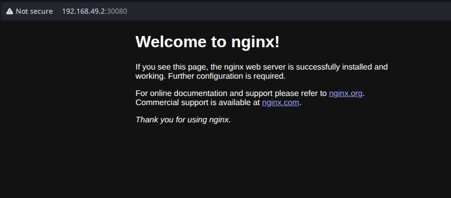

# How to create a Helm chart from scratch to deploy an Nginx Deployment


## 1. Create a helm chart directory 

```
aswin@HP Create-Helm-Chart-for-Nginx-Deployment$ helm create my-nginx
Creating my-nginx

# You can see, the create command created a sample directory structure with sample files to work on

aswin@HP my-nginx$ ll
total 32
drwxr-xr-x 4 aswin aswin 4096 Nov 22 14:22 ./
drwxrwxr-x 3 aswin aswin 4096 Nov 22 14:22 ../
drwxr-xr-x 2 aswin aswin 4096 Nov 22 14:22 charts/
-rw-r--r-- 1 aswin aswin 1144 Nov 22 14:22 Chart.yaml
-rw-r--r-- 1 aswin aswin  349 Nov 22 14:22 .helmignore
drwxr-xr-x 3 aswin aswin 4096 Nov 22 14:22 templates/
-rw-r--r-- 1 aswin aswin 4294 Nov 22 14:22 values.yaml

```

## 2. Edit the chart.yaml file

This file is the metadata file of a Helm chart.It defines the chart's name, version, description, type, and dependencies, so Helm knows how to package, install, upgrade, and validate the chart.

```
apiVersion: v2
name: my-nginx
description: Basic Nginx helm chart created to learn helm concepts

#There are 2 types of charts

# 1. application: A deployable chart that contains templates and creates Kubernetes resources.
# 2. library: A reusable helper chart that contains functions, not deployable by itself.

type: application

# This is the chart version. This version number should be incremented each time you make changes
#eg: 1.0 is wrong, and 0.1.0 is valid because, it require to follow strict SemVer style.

version: 0.1.0

# This is the version number of the application being deployed.
# Versions are not expected to follow Semantic Versioning.
# It is recommended to use it with quotes.
appVersion: "1.0"

# Note: version must not be a string because it must follow SemVer style, while appVersion must be string
```

## 3. Create a deployment template file

This file must in inside the template directory

```
apiVersion: apps/v1
kind: Deployment
metadata:
  name: {{ .Release.Name }}-nginx
  labels:
    app: {{ .Release.Name }}-nginx
spec:
  replicas: {{ .Values.replicas }}
  selector:
    matchLabels:
      app: {{ .Release.Name }}-nginx
  template:
    metadata:
      labels:
        app: {{ .Release.Name }}-nginx
    spec:
      containers:
        - name: nginx
          image: "{{ .Values.image.repository }}:{{ .Values.image.tag }}"
          ports:
            - containerPort: 80

```
### Explanation of the syntax

1. {{ }}: This is Go template delimiter. Anything inside the  {{...}} will be evaluated by Helm Go templating 

2. .Release.Name:  Dot (.) represents the current context in go templates, "." contain all the information about the current object, such as data in: Release, chart, values, Files etc
    * Release_Name is metadata that contain the name of the helm release (eg: my-nginx)
    * Values.replicas: This represent a value that is stored in the values.yaml file, So the actual value of "replicas" key will be returned here.
    * Values.image.repository: This access the content of values.yaml->find the key "image"->move to sub key "repository" and returned it here

## 4. Create the services.yaml file

This file is used to create the service by using which kubernetes can expose our application to outside world.

```
apiVersion: v1
kind: Service
metadata:
  name: {{ .Release.Name }}-svc
spec:
  type: {{ .Values.service.type }}
  selector:
    app: {{ .Release.Name }}-nginx
  ports:
    - port: 80
      targetPort: 80
      nodePort: {{ .Values.service.nodePort | default 30080 }}
```

### Explanation of the syntax

1. {{ .Values.service.nodePort | default 30080 }} : It will check the value of nodePort from  values.yaml -> services. If nodePort value is empty, it assign the default value 30080.


## 5. Create the values.yaml file

values.yaml file contains the key and its value that the helm  uses to replace when the chart is installed. It substitute the actual value from the values.yaml to the chart.

```
replicas: 1

image:
  repository: nginx
  tag: "latest"

service:
  type: NodePort
  nodePort: 30080
```

## 6. Debug the chart

In this stage, our chart is ready to be deployed. But before that, we need to ensure the chart is error free, to do these we use the following mechanism.

1. Linting: Lint check the syntax and formatting of the chart

```
aswin@HP Create-Helm-Chart-for-Nginx-Deployment$ helm lint my-nginx
==> Linting my-nginx
[INFO] Chart.yaml: icon is recommended

1 chart(s) linted, 0 chart(s) failed
```
The results shows no errors, and we are good to go.


## 7. Install the chart

```
aswin@HP Create-Helm-Chart-for-Nginx-Deployment$ helm install aswin-nginx my-nginx
NAME: aswin-nginx
LAST DEPLOYED: Sat Nov 22 14:59:48 2025
NAMESPACE: default
STATUS: deployed
REVISION: 1
TEST SUITE: None
```
Chart is deployed successfully. Lets verify

```
aswin@HP Create-Helm-Chart-for-Nginx-Deployment$ kubectl get deploy
NAME                READY   UP-TO-DATE   AVAILABLE   AGE
aswin-nginx-nginx   1/1     1            1           78s
aswin@HP Create-Helm-Chart-for-Nginx-Deployment$ kubectl get svc | grep aswin-nginx
aswin-nginx-svc     NodePort    10.109.38.221   <none>        80:30080/TCP   83s
```
As you can see, the deployment and service are deployed successfully. Note the port " 80:30080/TCP", 30080 was fetched from the values.yaml file.

## 8. Access the application

As we are using minikube to deploy the kubernetes cluster, a port forwarding is require:

The following command will perform the port forwarding for the service

```
aswin@HP Create-Helm-Chart-for-Nginx-Deployment$ minikube service aswin-nginx-svc
|-----------|-----------------|-------------|---------------------------|
| NAMESPACE |      NAME       | TARGET PORT |            URL            |
|-----------|-----------------|-------------|---------------------------|
| default   | aswin-nginx-svc |          80 | http://192.168.49.2:30080 |
|-----------|-----------------|-------------|---------------------------|
🎉  Opening service default/aswin-nginx-svc in default browser...
```

Now verify the Nginx by accessing the <IP>:30080 or localhost:30080




### We have successfully created a helm chart from scratch, and deployed an nginx deployment on a Kubernetes cluster.


