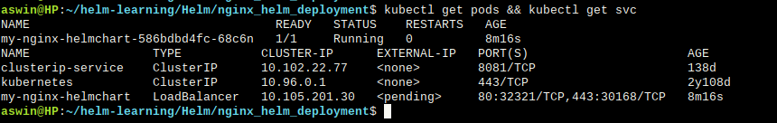
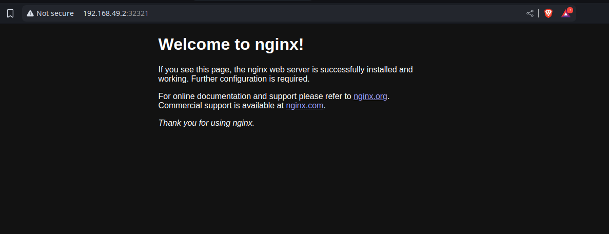

# Deploy an Nginx Helm deployment on Kubernetes (Using official nginx helm chart)

### Note: Check the my-nginx directory to find how to create a custom helm chart

## 1. Add the Bitnami helm repository to download helm chart.

```
helm repo add bitnami https://charts.bitnami.com/bitnami
helm repo update
```

## 2. Search nginx Helm Chart
```
helm search repo nginx
```

## 3. Deploy the nginx helm chart
```
helm install my-nginx bitnami/nginx
```

## . Verify the status of deployment

```
kubectl get pods && kubectl get svc  #It will list the deployed pod and the associated service
```

## Result



