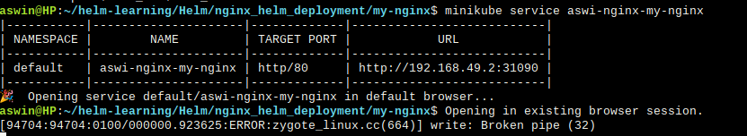

## This is a custom created nginx helm chart.

How is it created?

1. helm create my-nginx  #This create a sample helm template and necessary files

2. Edit the values.yaml file according to your requirements. I modified the following:

```
image of deployment
tag
replica
service type
```

3. Render the chart locally (DRY RUN)

```
helm template demo-nginx ./my-nginx
```

4. Deploy the chart

```
helm install demo-nginx ./my-nginx
```

5. Access the application through the service (Through Minikube)

```
minikube service aswi-nginx-my-nginx
```

#Result




